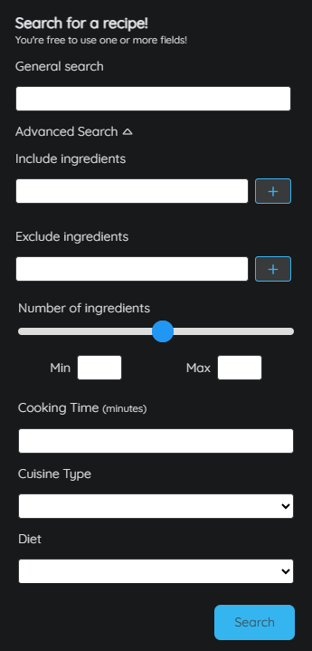
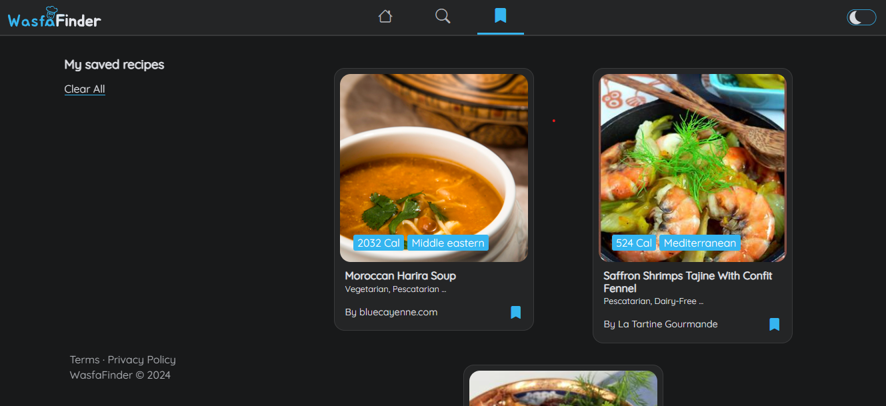

# Wasfa Finder App

 

# Description

<b>WasfaFinder</b> is a user-friendly web application tailored for individuals struggling with meal decisions. It allows users to search for recipes based on filters like time, dietary restrictions, ingredients, cuisine type, or meal type, or simply browse through a curated collection of recipes. The platform aims to simplify meal planning by providing a convenient way to explore diverse culinary options and discover new dishes.  
Whether users need quick recipes for busy nights or elaborate meals for special occasions, <b>WasfaFinder</b> offers a vast database to suit every taste. Its customizable search options empower users to embark on a culinary journey with ease.

## Features

* <b>WasfaFinder</b> is designed with responsiveness in mind, ensuring a seamless user experience across various devices and screen sizes. Whether accessed on desktops, laptops, tablets, or smartphones, the layout and elements of the application adapt dynamically to fit the viewport, providing optimal usability and readability.

  
  
<em>View representation of the WasfaFinder interface on desktop</em>

  
  
<em>View representation of the WasfaFinder interface on tablette</em>

  
  
<em>View representation of the WasfaFinder interface on mobile</em>

* <b>WasfaFinder</b> offers a customizable theme experience, allowing users to switch between dark and light modes effortlessly. With this feature, users can tailor the interface to their preferences and enhance readability based on their environment or personal preference.

  
  
<em>View representations of the WasfaFinder interface in dark mode</em>

  
  
<em>View representation of the WasfaFinder interface in light mode</em>

 * <b>WasfaFinder</b> provides an advanced search feature with various filters to streamline your recipe exploration. Tailor your search results by including or excluding specific ingredients, adjusting cooking time, selecting dietary preferences, cuisine types, and even filtering recipes based on the range of the number of ingredients. Whether you're looking for quick meals, dietary-specific options, or exploring diverse cuisines, our advanced search ensures you find the perfect recipe to suit your preferences. Experience effortless recipe discovery with our comprehensive search filters.

  
  
<em>View representation of the WasfaFinder general search interface</em>

  
  
<em>View representation of the WasfaFinder advanced search interface</em>

* WasfaFinder intelligently suggests dishes based on the user current mealtime. Seamlessly synchronized with the user local time, WafsaFinder presents a curated menu of mealtime options, ensuring that every recipe recommendation aligns perfectly with your schedule. 

  
  
<em>View representation of the mealtime menu in the Home page</em>

* Saving and discovering the user's favorite recipes is easier with WafsaFinder. With just a simple tap, user can mark recipes as favorites, creating a personalized collection of go-to dishes. The Saved Recipes page serves as a digital recipe box, providing quick and easy access to all the saved recipes.

  
  
<em>View representation of the saved recipes page</em>

## Installation

To run wasfaFinder locally, follow these steps:

1. Clone the repository: `git clone https://github.com/aitmensouryassine/wasfa-finder-app.git`
2. Install the required dependencies: `npm install`
3. Start the development server: `npm start`
4. Open [http://localhost:3000](http://localhost:3000) to view it in your browser.

## Technologies

### Front-End
* React.js: A JavaScript library for building user interfaces.
* react-router-dom: Package that provides routing capabilities to React applications. It allows us to create single-page applications with multiple views, each represented by its own component.
* Sass (Syntactically Awesome Style Sheets): is a preprocessor scripting language that is interpreted or compiled into Cascading Style Sheets (CSS). Sass extends CSS with features like variables, nesting, mixins, and inheritance, which make stylesheets more maintainable and easier to work with.
* Axios: Popular JavaScript library used for making HTTP requests from web browsers and Node.js applications. It provides a simple and intuitive API for sending asynchronous HTTP requests to REST endpoints, fetching data from servers, and handling responses. Axios supports features like request and response interceptors, promise-based API, automatic JSON data transformation, cancellation of requests, and error handling.

# Authors :

- **HAJAR EL ABDELLAOUI** <[ELABDELLAOUI-HAJAR](https://github.com/ELABDELLAOUI-HAJAR)>
- **YASSINE AIT MENSOUR** <[aitmensouryassine](https://github.com/aitmensouryassine)>
